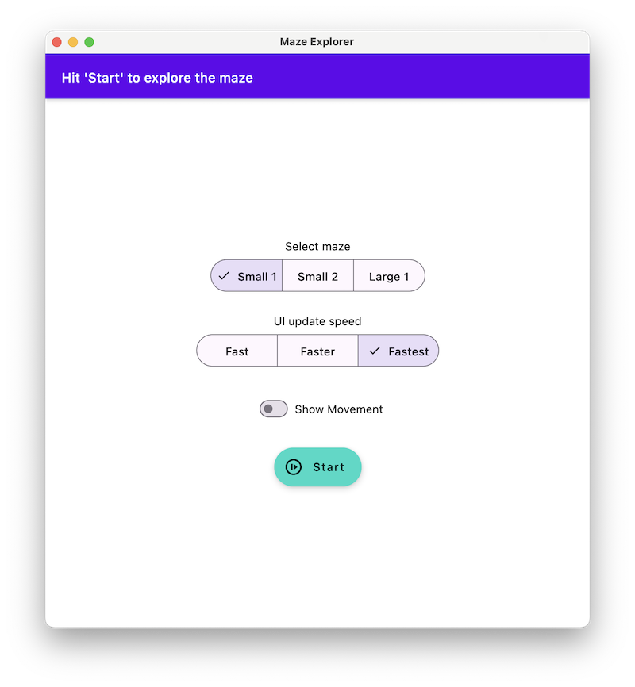

## Visualize Advent of Code puzzles

Playground for Kotlin Multiplatform Composable to visualize some of the AOC-2024 puzzles.

See also the [other repo](https://github.com/stefanroeck/advent-of-code-2024) for all solved puzzles.

### Screenshots

